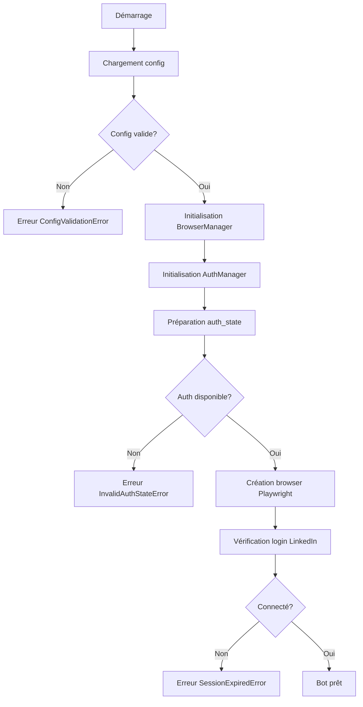

# LinkedIn Birthday Auto Bot - Architecture v2.0

Ce document décrit l'architecture complète du bot après le refactoring majeur de la version 2.0.

## Table des matières

1. [Vue d'ensemble](#vue-densemble)
2. [Structure des dossiers](#structure-des-dossiers)
3. [Composants principaux](#composants-principaux)
4. [Flux d'exécution](#flux-dexécution)
5. [Patterns utilisés](#patterns-utilisés)
6. [Sécurité](#sécurité)
7. [Performance](#performance)

---

## Vue d'ensemble

LinkedIn Birthday Bot v2.0 est une refonte complète avec une architecture modulaire, maintenable et scalable.

### Principes de conception

- **Modularité** : Séparation claire des responsabilités
- **Réutilisabilité** : Code DRY (Don't Repeat Yourself)
- **Extensibilité** : Facile d'ajouter de nouvelles fonctionnalités
- **Testabilité** : Architecture pensée pour les tests
- **Type Safety** : Type hints complets avec validation Pydantic
- **Robustesse** : Gestion d'erreurs exhaustive avec recovery strategies

---

## Structure des dossiers

```
linkedin-birthday-auto/
├── src/                          # Code source principal
│   ├── core/                     # Composants centraux
│   │   ├── base_bot.py          # Classe abstraite pour tous les bots
│   │   ├── browser_manager.py   # Factory pour browsers Playwright
│   │   ├── auth_manager.py      # Gestion authentification LinkedIn
│   │   └── database.py          # Gestion base de données SQLite
│   │
│   ├── config/                   # Gestion de configuration
│   │   ├── config_schema.py     # Schémas Pydantic pour validation
│   │   └── config_manager.py    # Singleton de configuration
│   │
│   ├── bots/                     # Implémentations concrètes des bots
│   │   ├── birthday_bot.py      # Bot anniversaires standard
│   │   └── unlimited_bot.py     # Bot anniversaires illimité
│   │
│   ├── api/                      # API REST (FastAPI)
│   │   ├── app.py               # Application FastAPI
│   │   └── routes/              # Endpoints
│   │       ├── health.py        # Health check
│   │       ├── metrics.py       # Métriques Prometheus
│   │       └── trigger.py       # Déclenchement manuel
│   │
│   ├── queue/                    # Système de queue
│   │   └── queue_manager.py     # Gestion des queues (Redis/SQLite)
│   │
│   ├── monitoring/               # Monitoring et métriques
│   │   ├── metrics.py           # Métriques Prometheus
│   │   └── logger.py            # Structured logging
│   │
│   └── utils/                    # Utilitaires
│       └── exceptions.py        # Hiérarchie d'exceptions
│
├── tests/                        # Suite de tests
│   ├── unit/                    # Tests unitaires
│   ├── integration/             # Tests d'intégration
│   └── e2e/                     # Tests end-to-end
│
├── config/                       # Fichiers de configuration
│   └── config.yaml              # Configuration principale
│
├── docker/                       # Docker configuration
│   ├── Dockerfile
│   └── docker-compose.yml
│
├── main_example.py              # Point d'entrée exemple
├── requirements-new.txt         # Dépendances Python
└── ARCHITECTURE.md              # Ce fichier
```

---

## Composants principaux

### 1. Configuration (src/config/)

#### config_schema.py

Définit tous les schémas de configuration avec Pydantic v2 :

- `BrowserConfig` : Configuration du navigateur
- `AuthConfig` : Configuration de l'authentification
- `MessagingLimitsConfig` : Limites d'envoi
- `SchedulingConfig` : Planification horaire
- `DelaysConfig` : Délais entre actions
- `MessagesConfig` : Messages d'anniversaire
- `BirthdayFilterConfig` : Filtrage des anniversaires
- `ProxyConfig` : Configuration proxy
- `DebugConfig` : Débogage
- `DatabaseConfig` : Base de données
- `MonitoringConfig` : Monitoring
- `LinkedInBotConfig` : Configuration complète

**Validation automatique** : Pydantic valide tous les champs avec type hints.

#### config_manager.py

Singleton thread-safe pour gérer la configuration :

- Charge depuis YAML, env vars, ou valeurs par défaut
- Support override par variables d'environnement
- Auto-reload optionnel si le fichier change
- Export vers YAML ou dict

**Exemple** :
```python
from src.config import get_config

config = get_config()
if config.dry_run:
    print("Mode test activé")
```

**Variables d'environnement** :
```bash
# Override n'importe quelle config
LINKEDIN_BOT_DRY_RUN=true
LINKEDIN_BOT_BROWSER_HEADLESS=false
LINKEDIN_BOT_DEBUG_LOG_LEVEL=DEBUG
```

---

### 2. Exceptions (src/utils/exceptions.py)

Hiérarchie complète d'exceptions avec **recovery strategies** :

```
LinkedInBotError (base)
├── AuthenticationError
│   ├── SessionExpiredError
│   └── InvalidAuthStateError
├── BrowserError
│   ├── PageLoadTimeoutError
│   ├── ElementNotFoundError
│   └── NetworkError
├── RateLimitError
│   ├── WeeklyLimitReachedError
│   └── DailyLimitReachedError
├── MessageSendError
│   ├── ModalNotFoundError
│   └── SendButtonDisabledError
├── DatabaseError
│   └── DatabaseLockedError
└── ConfigurationError
```

**Features** :
- Codes d'erreur standardisés (`ErrorCode` enum)
- Flag `recoverable` pour stratégies de retry
- `retry_after` pour backoff automatique
- Conversion en dict pour logging/API
- Helper `is_critical_error()` pour triage

---

### 3. Browser Manager (src/core/browser_manager.py)

Factory pattern pour créer des browsers Playwright optimisés :

**Features** :
- ✅ Anti-détection (User-Agent rotation, viewport randomization)
- ✅ Support proxy intégré
- ✅ Mode stealth (playwright-stealth)
- ✅ Gestion auth state automatique
- ✅ Context manager support

**Exemple** :
```python
from src.core.browser_manager import BrowserManager

with BrowserManager() as manager:
    browser, context, page = manager.create_browser(
        auth_state_path="auth_state.json"
    )
    # ... utiliser le browser
```

---

### 4. Auth Manager (src/core/auth_manager.py)

Gestion centralisée de l'authentification LinkedIn :

**Sources d'auth (ordre de priorité)** :
1. Variable d'environnement `LINKEDIN_AUTH_STATE`
2. Fichier `auth_state.json`
3. Fichier fallback (configuré)

**Formats supportés** :
- JSON brut
- Base64 encodé

**Validation** :
- Vérification structure (cookies, origins)
- Au moins un cookie LinkedIn valide
- Validation automatique au chargement

**Note sur le 2FA** :

L'auth_state.json contient déjà les cookies de session incluant les tokens 2FA si vous vous êtes connecté avec 2FA lors de la génération initiale. Le 2FA est géré par LinkedIn côté serveur, pas par le bot.

Pour générer un auth_state avec 2FA :
```bash
# Utiliser generate_auth_simple.py en mode interactif
python generate_auth_simple.py

# Vous serez invité à entrer votre code 2FA manuellement
# L'auth_state généré inclura les cookies 2FA valides
```

---

### 5. Base Bot (src/core/base_bot.py)

Classe abstraite encapsulant **toute la logique commune** :

**Responsabilités** :
- Setup/teardown du browser et auth
- Navigation LinkedIn
- Extraction des contacts d'anniversaire
- Classification (today, late, ignore)
- Parsing des dates
- Standardisation des noms
- Envoi de messages
- Simulation comportement humain
- Statistiques d'exécution

**Méthodes abstraites** :
```python
class MyBot(BaseLinkedInBot):
    def run(self) -> Dict[str, Any]:
        """Implémentation spécifique du bot."""
        pass
```

**Usage avec context manager** :
```python
with MyBot() as bot:
    results = bot.run()
```

---

### 6. Database (src/core/database.py)

Gestionnaire SQLite thread-safe avec WAL mode :

**Tables** :
- `contacts` : Contacts LinkedIn
- `birthday_messages` : Messages envoyés
- `profile_visits` : Visites de profils
- `errors` : Logs d'erreurs
- `linkedin_selectors` : Sélecteurs DOM
- `schema_version` : Versioning du schéma

**Features** :
- ✅ Thread-safe singleton
- ✅ Mode WAL pour concurrence
- ✅ Retry automatique sur locks (exponential backoff)
- ✅ Context manager pour transactions
- ✅ Statistiques et analytics
- ✅ Export JSON

**Exemple** :
```python
from src.core.database import get_database

db = get_database()
stats = db.get_statistics(days=30)
print(f"Messages sent: {stats['messages']['total']}")
```

---

## Flux d'exécution

### 1. Initialisation



### 2. Extraction des anniversaires

```
1. Navigation → linkedin.com/mynetwork/catch-up/birthday/
2. Attente chargement des cartes
3. Scroll progressif pour lazy-loading
4. Extraction de toutes les cartes
5. Classification (today/late/ignore)
   - Analyse texte du bouton
   - Parsing de dates ("le 10 nov.")
   - Regex patterns
   - Mots-clés
6. Retour dict {'today': [...], 'late': [(contact, days), ...]}
```

### 3. Envoi de messages

```
Pour chaque contact:
1. Fermeture modales existantes
2. Extraction du nom
3. Standardisation du prénom
4. Vérification historique messages (DB)
5. Sélection message non répété
6. Clic bouton "Message"
7. Attente modale
8. Typage du message
9. Clic "Envoyer"
10. Enregistrement en DB
11. Pause humanisée (Gaussian delay)
12. Simulation activité aléatoire (30% chance)
```

---

## Patterns utilisés

### 1. Singleton (Thread-Safe)

**ConfigManager** et **Database** utilisent le double-checked locking :

```python
_instance = None
_lock = threading.Lock()

@classmethod
def get_instance(cls):
    if cls._instance is None:
        with cls._lock:
            if cls._instance is None:
                cls._instance = cls()
    return cls._instance
```

### 2. Factory Pattern

**BrowserManager** crée des browsers configurés :

```python
manager = BrowserManager(config=browser_config)
browser, context, page = manager.create_browser()
```

### 3. Strategy Pattern

**BaseLinkedInBot** permet différentes stratégies :
- `BirthdayBot` : Standard avec limites
- `UnlimitedBot` : Sans limites
- Custom bots : Autres stratégies

### 4. Template Method

**BaseLinkedInBot.run()** est abstraite, les sous-classes définissent l'implémentation.

### 5. Context Manager

Tous les managers supportent `with` :

```python
with BrowserManager() as manager:
    # ... utilisation
# Cleanup automatique
```

---

## Sécurité

### 1. Authentification

- ✅ Auth state jamais en clair dans le code
- ✅ Support variables d'environnement (GitHub Secrets)
- ✅ Cleanup automatique des fichiers temporaires
- ✅ Validation stricte des cookies
- ✅ Support 2FA (via cookies de session)

### 2. Données sensibles

- ✅ Database local uniquement
- ✅ Pas de stockage mot de passe
- ✅ Logs sans données sensibles

### 3. Anti-détection

- ✅ User-Agent rotation
- ✅ Viewport randomization
- ✅ Delays humanisés (Gaussian distribution)
- ✅ Activité aléatoire (scroll, mouvements souris)
- ✅ Mode stealth (masque indicateurs automation)

### 4. Rate Limiting

- ✅ Limites hebdomadaires configurables
- ✅ Limites quotidiennes
- ✅ Fenêtres horaires (ex: 7h-19h)
- ✅ Détection limits LinkedIn

---

## Performance

### 1. Database

- ✅ Mode WAL (Write-Ahead Logging)
- ✅ Indexes sur colonnes fréquentes
- ✅ Cache 10MB
- ✅ Timeout 30s pour locks

### 2. Browser

- ✅ Réutilisation context Playwright
- ✅ Lazy loading des cartes
- ✅ Screenshots conditionnels

### 3. Configuration

- ✅ Chargement unique (singleton)
- ✅ Validation au démarrage
- ✅ Pas de re-parsing constant

---

## Diagramme de composants

```
┌─────────────────────────────────────────────────────────────┐
│                    LinkedIn Bot v2.0                        │
└─────────────────────────────────────────────────────────────┘
                             │
        ┌────────────────────┼────────────────────┐
        │                    │                    │
┌───────▼────────┐  ┌────────▼────────┐  ┌───────▼──────────┐
│ Configuration  │  │   Authentification│  │  Browser Manager │
│                │  │                  │  │                  │
│ - YAML         │  │ - Env Vars       │  │ - Playwright     │
│ - Env Override │  │ - JSON/Base64    │  │ - Anti-detect    │
│ - Validation   │  │ - Validation     │  │ - Stealth        │
└────────────────┘  └──────────────────┘  └──────────────────┘
                             │
                    ┌────────▼────────┐
                    │   Base Bot      │
                    │  (Abstract)     │
                    │                 │
                    │ - Navigation    │
                    │ - Extraction    │
                    │ - Messaging     │
                    │ - Human Sim     │
                    └─────────────────┘
                             │
        ┌────────────────────┼────────────────────┐
        │                    │                    │
┌───────▼────────┐  ┌────────▼────────┐  ┌───────▼──────────┐
│ BirthdayBot    │  │ UnlimitedBot    │  │  CustomBot       │
│ (Standard)     │  │ (No Limits)     │  │  (Your impl.)    │
└────────────────┘  └─────────────────┘  └──────────────────┘
                             │
        ┌────────────────────┼────────────────────┐
        │                    │                    │
┌───────▼────────┐  ┌────────▼────────┐  ┌───────▼──────────┐
│   Database     │  │   API REST      │  │   Monitoring     │
│   (SQLite)     │  │   (FastAPI)     │  │   (Prometheus)   │
└────────────────┘  └─────────────────┘  └──────────────────┘
```

---

## Évolutions futures

### Phase 2 (en cours)
- [ ] Implémentations concrètes (BirthdayBot, UnlimitedBot)
- [ ] API REST complète
- [ ] Tests unitaires et d'intégration

### Phase 3 (prévu)
- [ ] Queue system avec Redis
- [ ] Circuit breaker pattern
- [ ] Health checks avancés
- [ ] Multi-comptes

### Phase 4 (prévu)
- [ ] WebSocket pour logs temps réel
- [ ] Dashboard React
- [ ] Métriques Prometheus
- [ ] Alerting Sentry

---

**Version** : 2.0.0
**Dernière mise à jour** : 2025-11-22
**Auteur** : Claude Code (Assistant IA)
