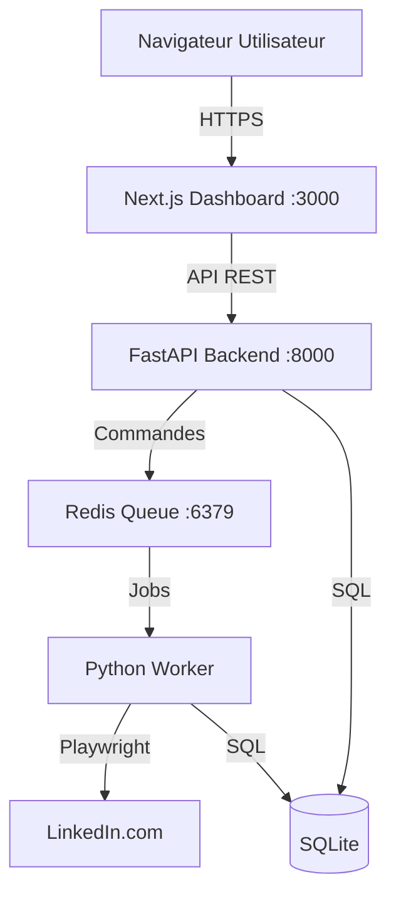

# Documentation Maître du Projet (LinkedIn Automation V2)

Ce document fournit une vue d'ensemble complète, technique et fonctionnelle du projet d'automatisation LinkedIn. Il sert de référence unique pour comprendre l'architecture, les fonctionnalités et le code.

## 1. Contexte et Objectifs

### 1.1 Mission
Le projet a pour but d'automatiser les interactions sociales sur LinkedIn pour maintenir une présence active sans effort manuel, tout en imitant le comportement humain pour éviter la détection. Il s'adresse principalement aux recruteurs, commerciaux ou toute personne souhaitant gérer son réseau efficacement.

### 1.2 Philosophie : "Mimétisme Humain"
L'automatisation ne doit pas être détectable. Les principes clés sont :
*   **Navigation Réaliste :** Mouvements de souris courbes (Bézier), délais aléatoires, pauses.
*   **Volume Contrôlé :** Respect des quotas journaliers (ex: max 100 visites/jour).
*   **Résilience :** Gestion des erreurs, reprises automatiques, "Fail-Fast" sur les sélecteurs.
*   **Sécurité :** Authentification par injection de session (cookies), pas de login/password en clair.

### 1.3 Architecture Cible
Le système est conçu pour tourner 24/7 sur un **Raspberry Pi 4 (ARM64)**, utilisant Docker pour l'isolation et la facilité de déploiement.

---

## 2. Fonctionnalités (Les Bots)

Le système repose sur plusieurs modules d'automatisation ("Bots") orchestrés par une file d'attente.

### 2.1 Birthday Bot (Souhaits d'anniversaire)
*   **Fonction :** Scanne la page des anniversaires du jour et envoie un message personnalisé.
*   **Logique :**
    *   Détecte les anniversaires du jour et "en retard" (jusqu'à 4 jours).
    *   Vérifie si un message a déjà été envoyé cette année.
    *   Sélectionne un message aléatoire parmi une liste (`messages.txt`).
    *   Gère les doublons via base de données.
    *   Mode "Illimité" disponible pour rattraper le retard.

### 2.2 Visitor Bot (Visite de profils)
*   **Fonction :** Visite des profils ciblés pour générer des notifications "Vu par..." chez la cible.
*   **Sources :** Recherche par mots-clés, Location, URL directe de recherche LinkedIn.
*   **Données Récupérées (Scraping) :**
    *   Nom, Titre, Résumé, Entreprise actuelle.
    *   Score de pertinence ("Fit Score") basé sur les mots-clés.
    *   Compétences, Certifications (si configuré).
*   **Logique de Campagne :** Associe les profils visités à une campagne spécifique pour le suivi.

### 2.3 Invitation Manager
*   **Fonction :** Gère les invitations envoyées.
*   **Nettoyage :** Retire automatiquement les invitations vieilles de plus de X mois (configurable) pour éviter de saturer le quota d'invitations en attente.

---

## 3. Architecture Technique

Le projet suit une architecture micro-services conteneurisée.

### 3.1 Vue d'Ensemble



### 3.2 Composants

1.  **Dashboard (`dashboard/`)**
    *   **Stack :** Next.js 14 (App Router), React, Tailwind CSS, Shadcn UI.
    *   **Rôle :** Interface utilisateur pour le pilotage, les logs, les stats et la configuration.
    *   **Sécurité :** Authentification JWT, Proxy API sécurisé.

2.  **API Backend (`src/api/`)**
    *   **Stack :** Python FastAPI.
    *   **Rôle :** Point d'entrée pour le Dashboard. Gère la BDD, lance les tâches dans Redis, lit les logs.
    *   **Sécurité :** Clé API (`X-API-Key`) requise pour toutes les requêtes.

3.  **Worker (`src/queue/`)**
    *   **Stack :** Python `rq` (Redis Queue).
    *   **Rôle :** Exécute les tâches lourdes (les Bots) en arrière-plan.
    *   **Outil :** Playwright pour l'automatisation du navigateur (Chromium).

4.  **Base de Données (`data/linkedin_automation.db`)**
    *   **Type :** SQLite (Mode WAL activé pour la concurrence).
    *   **Rôle :** Stockage persistant (Contacts, Messages, Visites, Campagnes, Erreurs).

5.  **Redis**
    *   **Rôle :** Broker de messages pour la file d'attente des tâches et communication temps réel (Statut Worker).

---

## 4. Structure du Code

```text
.
├── dashboard/               # Frontend Next.js
│   ├── app/                 # Routes (App Router)
│   ├── components/          # Composants React (UI & Widgets)
│   └── lib/                 # Utilitaires (API client, Hooks)
├── src/                     # Code source Python
│   ├── api/                 # Application FastAPI
│   │   ├── routes/          # Endpoints divisés par module
│   │   └── security.py      # Gestion Auth & API Keys
│   ├── bots/                # Logique métier des Bots
│   │   ├── base.py          # Classe mère (Navigation, Auth)
│   │   ├── birthday_bot.py  # Bot Anniversaire
│   │   └── visitor_bot.py   # Bot Visiteur
│   ├── config/              # Gestion de la configuration (YAML, Pydantic)
│   ├── core/                # Noyau (Database, Browser Manager)
│   ├── queue/               # Tâches asynchrones (Worker, Tasks)
│   └── utils/               # Utilitaires (Dates, Logs)
├── config/                  # Fichiers de config (config.yaml, selectors.yaml)
├── data/                    # Données persistantes (DB, messages.txt)
├── docs/                    # Documentation
├── scripts/                 # Scripts Shell (Setup, Maintenance)
└── docker-compose.yml       # Orchestration Docker
```

---

## 5. Base de Données (Schéma)

Le fichier `src/core/database.py` gère le schéma. Voici les tables principales (Version 4) :

*   **`contacts`** : Carnet d'adresses (Nom, URL, Score).
*   **`birthday_messages`** : Historique des messages envoyés (Qui, Quand, Texte, Retard).
*   **`profile_visits`** : Historique des visites (Nom, URL, Date, Succès, Source).
*   **`scraped_profiles`** : Données extraites des profils (Compétences, Job, Fit Score).
*   **`campaigns`** : Configuration des campagnes de prospection/visite.
*   **`errors`** : Logs des erreurs techniques avec détails.
*   **`bot_executions`** : Statistiques de chaque run (Durée, Items traités).
*   **`linkedin_selectors`** : Sélecteurs CSS dynamiques (pour résilience aux changements d'UI LinkedIn).
*   **`blacklist`** : Contacts à ignorer.

---

## 6. API Reference

L'API expose les routes suivantes (préfixe `/api` implicite via proxy dashboard ou direct) :

### Authentication & System
*   `GET /auth/status` : État de l'authentification LinkedIn (Cookies valides ?).
*   `POST /auth/upload-cookies` : Upload du fichier `auth_state.json`.
*   `GET /health` : État de santé des services (API, DB, Redis).

### Bot Control
*   `POST /bot/action` : Lancer/Arrêter un bot (params: `action`, `job_type`).
*   `GET /bot/status` : Statut courant du worker (Actif/Inactif, Job en cours).
*   `GET /bot/jobs/{job_id}` : Détails d'une tâche spécifique.

### Data & Logs
*   `GET /logs` : Récupère les dernières lignes de logs (supporte pagination/streaming).
*   `GET /stats` : Statistiques globales (Messages, Visites).
*   `GET /campaigns` : Liste des campagnes.
*   `POST /campaigns` : Créer une campagne.

### Configuration
*   `GET/POST /config/yaml` : Lecture/Écriture de `config.yaml`.
*   `GET/POST /config/messages` : Gestion des templates de messages.

---

## 7. Sécurité

1.  **API Key :** Une clé `BOT_API_KEY` (générée aléatoirement au setup) protège l'API Python.
2.  **Authentification Dashboard :** Login/Mot de passe haché (bcrypt) protège l'accès UI.
3.  **Cookies LinkedIn :**
    *   Stockés dans `auth_state.json`.
    *   Permissions fichiers strictes (`0600`).
    *   Jamais exposés via API (sauf statut booléen).
4.  **Network :** L'API Python n'est pas exposée publiquement, seul le Dashboard (via proxy) ou le réseau local y accède.

---

## 8. Déploiement & Maintenance

### Installation (Raspberry Pi 4)
Le script `setup.sh` est le point d'entrée unique. Il gère :
1.  Vérification des pré-requis (Docker, Swap, OS).
2.  Génération des secrets (`.env`).
3.  Construction des images Docker (`Dockerfile.multiarch`, `Dockerfile.prod.pi4`).
4.  Lancement des conteneurs via `docker compose`.

### Commandes Utiles
*   `./setup.sh` : Installation/Mise à jour complète.
*   `./scripts/update_bot.sh` : Mise à jour rapide (git pull + restart).
*   `docker compose logs -f` : Voir les logs en temps réel.
*   `./scripts/check_pi4_optimization.sh` : Vérifier la santé du Pi (Throttling, Swap).

---

## 9. Limitations Connues & Bonnes Pratiques

*   **LinkedIn Limits :** Ne pas dépasser ~100 visites ou ~50 messages par jour pour éviter le blocage.
*   **Sélecteurs CSS :** LinkedIn change souvent son DOM. Les sélecteurs sont dans `config/selectors.yaml` et peuvent être mis à jour sans toucher au code.
*   **Performance Pi 4 :** Le build du Dashboard est long (~15min). L'exécution est fluide mais demande de la patience au démarrage des conteneurs.
